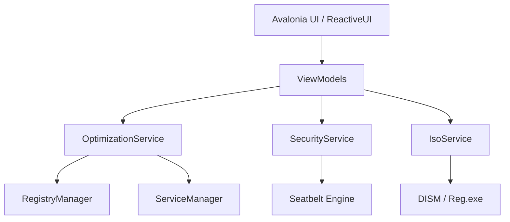

# 👻 PhantomOS

**PhantomOS** is an industrialized, open-source system optimization and security suite for Windows. Built with **Avalonia UI** and **.NET 10**, it provides a modular, transparent, and high-performance approach to system hardening.

---

## 🚀 Key Features

### 🛠️ Intelligent Optimization
- **Hardware-Aware Engine**: Automatically detects CPU, GPU, RAM, and Disk type (SSD/HDD) to recommend tailored tweaks.
- **Atomic Catalog**: Over 20+ documented tweaks for Gaming, Privacy, Networking, and Performance.
- **Smart Fix**: Apply all recommended safe optimizations with one click.

### 🛡️ Security Audit (Powered by Seatbelt)
- **Deep Audit**: Integrated security engine that scans for UAC misconfigurations, insecure service permissions, and more.
- **Security Score**: A visual health indicator (0-100%) of your system's attack surface.
- **One-Click Hardening**: Instantly fix critical security vulnerabilities.

### 👻 Telemetry Zero
- **Total Privacy**: Block Windows tracing, Bing search in Start Menu, Cortana, and background data collectors.
- **Panic Button**: Quickly revert privacy settings to factory defaults if needed.

### 💿 ISO Creator (Industrial Deployment)
- **Offline Tweaking**: Mount `.wim` images and apply PhantomOS optimizations directly to the image.
- **Debloater**: Remove pre-installed provisioned packages from offline images.

---

## 🏗️ Architecture

---

## 💻 Technical Specifications
- **Framework**: Avalonia UI 11+
- **Pattern**: MVVM (ReactiveUI)
- **OS Target**: Windows 10 (Build 19041+) / Windows 11
- **Privileges**: Requires Administrator status (Manifested).

---

## 🤝 Contributing
Contributions are welcome! Please see [CONTRIBUTING.md](CONTRIBUTING.md) for guidelines.

## 📄 License
Distributed under the **MIT License**. See `LICENSE` for more information.

---
*Created with ❤️ by **clevervi** and the PhantomOS Community.*
