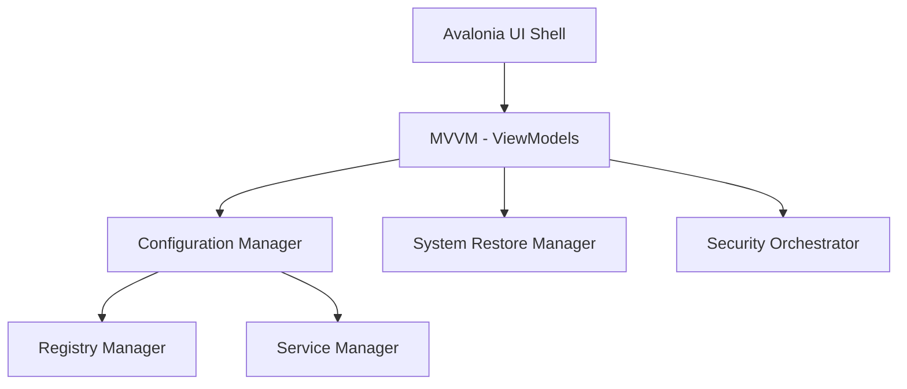

# 🌌 PhantomOS

[](https://opensource.org/licenses/MIT)
[](https://dotnet.microsoft.com/)
[](https://avaloniaui.net/)

**PhantomOS** is a high-performance, open-source Windows optimization and security orchestrator built in C# and Avalonia UI. It provides deep system refinement through a granular "Atomic Tweak" architecture, ensuring transparency, education, and safety.

---

## 🚀 Key Features

- **Atomic Tweaks**: A modular catalog of system adjustments. No monoliths, just granular control.
- **Hybrid Profiles**: Combine atomic tweaks into specialized profiles (Gaming, Work, Privacy).
- **Security Orchestration**: Deep system analysis via integrated security tools (Seatbelt).
- **Safety First**: Automatic System Restore points and registry key backups before any change.
- **Educational UI**: Every tweak explains the *What*, *Why*, and *Why Not* of the setting.
- **Premium Design**: Modern, glassmorphism-inspired UI with Acrylic/Mica effects.

---

## 🏗️ Architecture

PhantomOS follows a modular architecture designed for extensibility and reliability:



- **Core**: Contains the engine for registry, service, and system restore management.
- **Models**: Defines the `AtomicTweak` and `Profile` data structures.
- **Data**: The centralized "Tweak Catalog".
- **Modules**: Standalone logic for ISO building and external security tool integration.

---

## 🛠️ Installation & Building

### Prerequisites
- .NET 10 SDK
- Windows 10/11 (Administrator privileges required)

### Build from Source
```bash
git clone https://github.com/clevervi/PhantomOS.git
cd PhantomOS
dotnet build -c Release
```

---

## 🛡️ Trust & Safety

PhantomOS is built on the principle of **Zero-Telemetry**. 
1. **Local Only**: All modifications happen on your machine.
2. **Open Source**: Every line of code is inspectable.
3. **Reversible**: Automatic backups are created for every registry key modified.

---

## 🤝 Contributing

We welcome contributions! Please see [CONTRIBUTING.md](CONTRIBUTING.md) for details on our code of conduct and the process for submitting pull requests.

## 📄 License

This project is licensed under the MIT License - see the [LICENSE](LICENSE) file for details.

---

**Developed with ❤️ by [clevervi](https://github.com/clevervi)**
